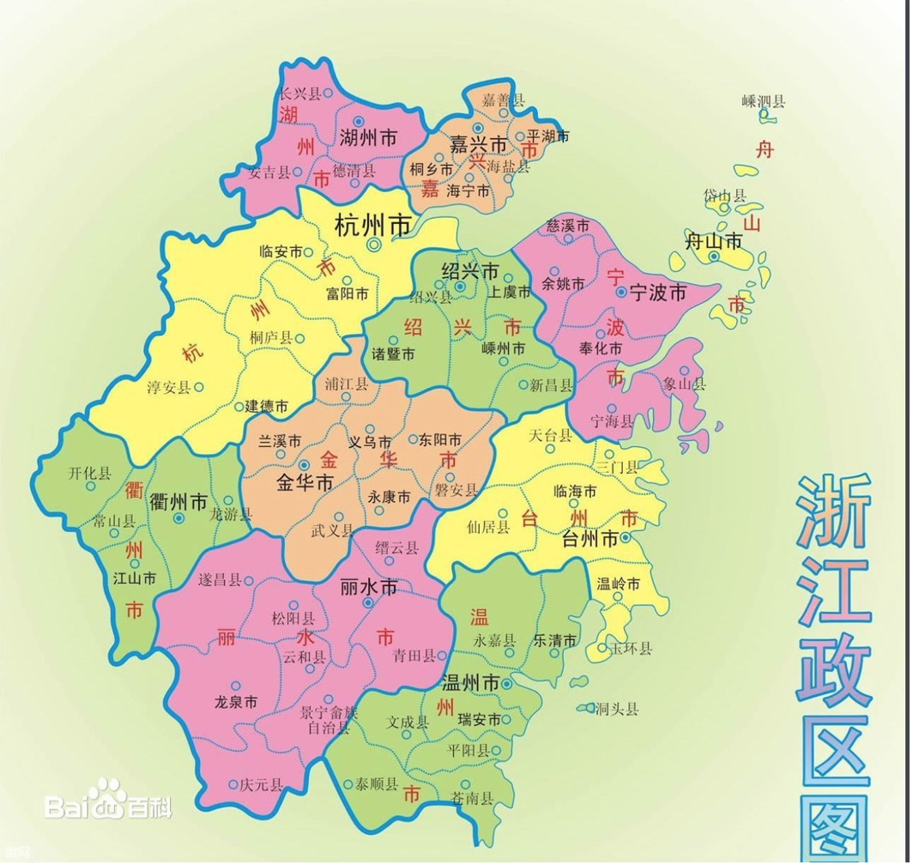

# HangZhou

####浙江区域图

####杭州市区在哪里
武林门为杭州市正中心，东边江干区，北边拱墅区，西边西湖区，南边上城区，这几个区都是市区，武林广场，和延安路，还有西湖边的东坡路、购物比较好，吴山广场、湖滨路比较好玩些。

####杭州百度百科
杭州，简称“杭”，浙江省省会，位于中国东南沿海、浙江省北部、钱塘江下游、京杭大运河南端，副省级市，是浙江省的政治、经济、文化、教育、交通和金融中心，长江三角洲城市群中心城市之一、环杭州湾大湾区城市、长三角宁杭生态经济带节点城市、 [1]  中国重要的电子商务中心之一。截至2017年，杭州下辖10个区、2个县，代管1个县级市，总面积16853.57平方千米（包含钱塘江水域面积，钱塘江河海分界线采用海盐澉浦—余姚西三闸连线） [2]  ，常住人口为946.8万人，城镇化率76.8% [3]  。2017年，杭州居民人均可支配收入49832元 [4]  ，社会消费品零售总额5717亿元，高新技术企业达2844家。 [5-6]   
杭州自秦朝设县治以来已有2200多年的历史，曾是吴越国和南宋的都城。因风景秀丽，素有“人间天堂”的美誉。杭州得益于京杭运河和通商口岸的便利，以及自身发达的丝绸和粮食产业，历史上曾是重要的商业集散中心。后来依托沪杭铁路等铁路线路的通车以及上海在进出口贸易方面的带动，轻工业发展迅速。新世纪以来，随着阿里巴巴等高科技企业的带动，互联网经济成为杭州新的经济增长点。  
杭州人文古迹众多，西湖及其周边有大量的自然及人文景观遗迹。其中主要具代表性的有西湖文化、良渚文化、丝绸文化、茶文化，以及流传下来的许多故事传说成为杭州文化代表。
2018年世界短池游泳锦标赛、2022年亚洲运动会将在杭州举办。2018年1月，杭州入选首批社会信用体系建设示范城市。2017年中国百强城市排行榜排第7位。  

- 中文名称
  杭州

- 外文名称
  Hangzhou City

- 别名
  临安、钱塘、武林、杭城

- 行政区类别
  地级市

- 所属地区
  中国华东

- 下辖地区
  10区、2县，代管1[县级市]

- 政府驻地
  [江干区] 解放东路18号（邮编：310026

- 电话区号
  (+86)0571

- 邮政区码
  310000

- 地理位置
  浙江省北部，钱塘江下游，京杭大运河南端

- 面积
  16853.57平方千米

- 人口
  946.8万人（2017年） 南京是827万人(2016)

- 方言
  吴语太湖片-杭州话、苕溪小片、临绍小片、苏沪嘉小片.徽语 严州片

- 气候条件
  亚热带季风气候

- 著名景点
西湖、京杭大运河、西溪湿地、灵隐寺、良渚遗址、六和塔、湘湖、浙江大学

- 机场
  杭州萧山国际机场

- 火车站
  杭州站、杭州东站、杭州南站

- 车牌代码
浙A 杭州市 
浙B 宁波市 
浙C 温州市 
浙D 绍兴市 
浙E 湖州市 
浙F 嘉兴市 
浙G 金华市 
浙H 衢(qú)州市 
浙J 台州市 
浙K 丽水市 
浙L 舟山市

- 地区生产总值
  12556亿元（2017年） [10]  南京是10503亿元(2016)

- 人均生产总值
  134607元（2017年） [10] 南京是127264元(2016)

- 市树、市花
  [香樟](https://baike.baidu.com/item/%E9%A6%99%E6%A8%9F)、[桂花](https://baike.baidu.com/item/%E6%A1%82%E8%8A%B1)

- 市歌
  《[梦想天堂](https://baike.baidu.com/item/%E6%A2%A6%E6%83%B3%E5%A4%A9%E5%A0%82/16005283)》

- 行政代码
  330100

- 市委书记
  [周江勇](https://baike.baidu.com/item/%E5%91%A8%E6%B1%9F%E5%8B%87) [12]

- 市    长
  [徐立毅](https://baike.baidu.com/item/%E5%BE%90%E7%AB%8B%E6%AF%85)

| [拱墅区](https://baike.baidu.com/item/%E6%8B%B1%E5%A2%85%E5%8C%BA) | 330105 | 88   | 56.2  | 310011 | [拱宸桥街道](https://baike.baidu.com/item/%E6%8B%B1%E5%AE%B8%E6%A1%A5%E8%A1%97%E9%81%93) |
| ---------------------------------------- | ------ | ---- | ----- | ------ | ---------------------------------------- |
| [上城区](https://baike.baidu.com/item/%E4%B8%8A%E5%9F%8E%E5%8C%BA) | 330102 | 18   | 34.8  | 310002 | [清波街道](https://baike.baidu.com/item/%E6%B8%85%E6%B3%A2%E8%A1%97%E9%81%93) |
| [下城区](https://baike.baidu.com/item/%E4%B8%8B%E5%9F%8E%E5%8C%BA) | 330103 | 31   | 53.1  | 310006 | [文晖街道](https://baike.baidu.com/item/%E6%96%87%E6%99%96%E8%A1%97%E9%81%93) |
| [江干区](https://baike.baidu.com/item/%E6%B1%9F%E5%B9%B2%E5%8C%BA) | 330104 | 210  | 112.8 | 330104 | [四季青街道](https://baike.baidu.com/item/%E5%9B%9B%E5%AD%A3%E9%9D%92%E8%A1%97%E9%81%93/10411877) |
| [西湖区](https://baike.baidu.com/item/%E8%A5%BF%E6%B9%96%E5%8C%BA) | 330106 | 263  | 86.0  | 330106 | [西湖街道](https://baike.baidu.com/item/%E8%A5%BF%E6%B9%96%E8%A1%97%E9%81%93/6598250) |
| [滨江区](https://baike.baidu.com/item/%E6%BB%A8%E6%B1%9F%E5%8C%BA) | 330108 | 73   | 33.6  | 330108 | [西兴街道](https://baike.baidu.com/item/%E8%A5%BF%E5%85%B4%E8%A1%97%E9%81%93) |
| [萧山区](https://baike.baidu.com/item/%E8%90%A7%E5%B1%B1%E5%8C%BA) | 330109 | 1163 | 165.5 | 330109 | [北干街道](https://baike.baidu.com/item/%E5%8C%97%E5%B9%B2%E8%A1%97%E9%81%93) |
| [余杭区](https://baike.baidu.com/item/%E4%BD%99%E6%9D%AD%E5%8C%BA) | 330110 | 1222 | 147.6 | 330110 | [临平街道](https://baike.baidu.com/item/%E4%B8%B4%E5%B9%B3%E8%A1%97%E9%81%93) |
| [富阳区](https://baike.baidu.com/item/%E5%AF%8C%E9%98%B3%E5%8C%BA) | 330111 | 1808 | 73.9  | 330111 | [富春街道](https://baike.baidu.com/item/%E5%AF%8C%E6%98%A5%E8%A1%97%E9%81%93) |
| [临安区](https://baike.baidu.com/item/%E4%B8%B4%E5%AE%89%E5%8C%BA) | 330112 | 3124 | 59.1  | 330112 | [锦城街道](https://baike.baidu.com/item/%E9%94%A6%E5%9F%8E%E8%A1%97%E9%81%93) |

杭州有着江、河、湖、山交融的自然环境。全市丘陵山地占总面积的65.6%，平原占26.4%，江、河、湖、水库占8%，世界上最长的人工[运河](https://baike.baidu.com/item/%E8%BF%90%E6%B2%B3)—京杭大运河和以大涌潮闻名的钱塘江穿过。

#### 杭州房价
https://www.anjuke.com/fangjia/hangzhou2018/yuhang/

#### 注意事项
火车票要早买，不比以前上海到南京好买到车票  
电瓶车购买靠谱老板的微信: tbycjp  

